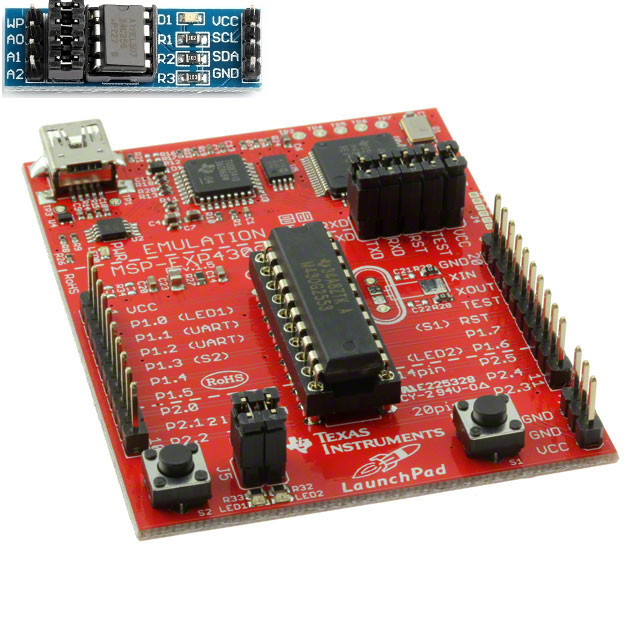

# BRINQ_SERIES

_____

Brinq Series é um projeto que tem como principal objetivo, disponibilizar soluções em determinadas tecnologias e assuntos. Para que você possa ter uma base de exemplos, baseado em resultados satisfatórios dos testes executados em meu laboratório.

Cada projeto irá ser acompanhado com um artigo ou tutorial elaborado no medium.com para dar suporte a sua pesquisa. 

As soluções disponíveis aqui, não foram testadas para uso em aplicações. A idéia é disponibilizar um ponto inicial, uma referência exploratória para cada assunto aqui proposto. 

_____
## Projetos

### 💻 msp430g2553/i2C_eeprom
_____

Este projeto demonstra a escrita e leitura de uma eeprom que se comunica por protocolo i2C. A execução da escrita para esse laboratório é de Byte por Byte. Assim como a execução da leitura obedece a mesma dinâmica. 

Para saber mais sobre esse projeto. 
 
Acesse:
 
https://medium.com/@weberasantos/salvando-e-lendo-bytes-em-uma-eeprom-i2c-a-partir-de-um-msp430g2553-eacb2ae32bdf

#### ⚠️ ATENÇÃO ⚠️

Essa versão do laboratório foi desenvolvido com placas experimentais, abstraindo toda lógica de circuito. Para criar esse hardware em um circuito ou protoboard. Verifique as técnicas utilizadas para ligação de componentes i2C em um barramento de comunicação.
 
 
 
_____
