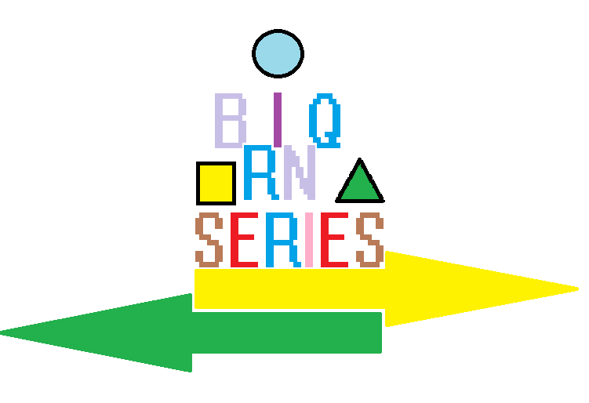
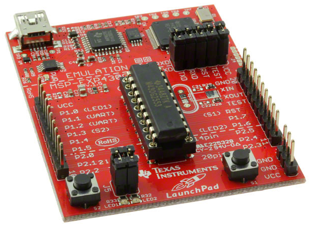

# BRINQ_SERIES

_____

Brinq Series é um projeto que tem como principal objetivo, disponibilizar soluções em determinadas tecnologias e assuntos. Para que você possa ter uma base de exemplos, baseado em resultados satisfatórios dos testes executados em meu laboratório.

Cada projeto irá ser acompanhado com um artigo ou tutorial elaborado no medium.com para dar suporte a sua pesquisa. 

As soluções disponíveis aqui, não foram testadas para uso em aplicações. A idéia é disponibilizar um ponto inicial, uma referência exploratória para cada assunto aqui proposto. 

_____
## Projetos

### 💻 msp430g2553/i2C_eeprom
_____

Este projeto demonstra a escrita e leitura de uma eeprom que se comunica por protocolo i2C. A execução da escrita para esse laboratório é de Byte por Byte. Assim como a execução da leitura obedece a mesma dinâmica. 

Para saber mais sobre esse projeto. 
 
Acesse:
 
https://medium.com/@weberasantos/salvando-e-lendo-bytes-em-uma-eeprom-i2c-a-partir-de-um-msp430g2553-eacb2ae32bdf

 
 

### 💻 msp430g2553/spi_23k640_sram
_____

Este projeto demonstra a escrita e leitura em uma SRAM que se comunica por protocolo SPI.

Para saber mais sobre esse projeto. 
 
Acesse:
 
https://medium.com/@weberasantos/gravando-e-lendo-a-mem%C3%B3ria-23k640-com-msp430g2553-d0864034d9f4

 
 

_____

#### ⚠️ ATENÇÃO ⚠️

Todos os experimentos Brinq Series são testes conceituais. É possível que não funcionem imediatamente em sua bancada, pois há diversas variáveis envolvidas, como condições ambientais, a forma de montagem do circuito na protoboard e até a qualidade dos materiais utilizados.

Esses fatores podem influenciar diretamente o resultado final. Portanto, siga boas práticas de eletrônica, como a utilização de capacitores de desacoplamento, resistores de pull-up e pull-down, a fim de reduzir ruídos e evitar comportamentos indesejados que possam comprometer sua experiência.